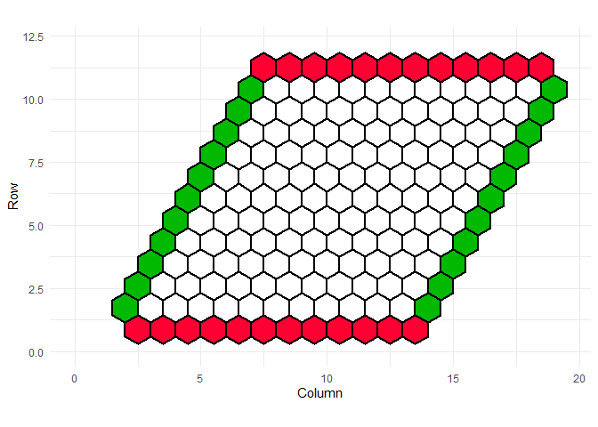

<!-- README.md is generated from README.Rmd. Please edit that file -->

# hexr

<!-- badges: start -->
<!-- badges: end -->

The goal of hexr is to playing hex boardgame with R!

## Installation

You can install the development version of hexr like so:

``` r
devtools::install_github("statditto/hexr")
```

## Example

This is a basic example which shows you how to solve a common problem:

``` r
library(hexr)
## basic example code
board <- initialize_hex_board()
plot_hex_board(board)
```



TBD
